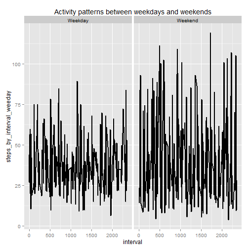

Reproducible Research - Peer Assignment 1
=========================================

## Loading and preprocessing the data

Load the data (i.e. read.csv())

Process/transform the data (if necessary) into a format suitable for your analysis


```r
library(dplyr)
library(ggplot2)

activity <- read.csv("./activity.csv")
```


## What is mean total number of steps taken per day?

1. Calculate the total number of steps taken per day

2. Make a histogram of the total number of steps taken each day

3. Calculate and report the mean and median of the total number of steps taken per day


```r
# Calcualate steps taken per day
activity_by_date <- group_by(activity, date)
steps_per_date <- summarize(activity_by_date, steps_per_date = sum(steps, na.rm = T))

# Plot a histogram of steps taken per day
with(steps_per_date, hist(steps_per_date, main = "Steps taken per day", col = "light blue", breaks = 10))

# Calculate and report the mean and median of the total number of steps taken per day
mean_steps_per_day <- round(mean(steps_per_date$steps_per_date), digits = 2)
median_steps_per_day <- round(median(steps_per_date$steps_per_date), digits = 2)
abline(v=mean_steps_per_day, lwd = 3, col = 'red')
abline(v=median_steps_per_day, lwd = 3, col = 'dark violet')

#create legend
legend("topright", lty = 1, lwd = 2, col = c("red", "dark violet"), cex = 0.75, 
       legend = c(paste('Mean:    ', mean_steps_per_day), 
                  paste('Median: ', median_steps_per_day)))
```

 


## What is the average daily activity pattern?

1. Make a time series plot (i.e. type = "l") of the 5-minute interval (x-axis) and the average number of steps taken, averaged across all days (y-axis)

2. Find which 5-minute interval, on average across all the days in the dataset, contains the maximum number of steps


```r
# Calculate average steps taken per 5 min interval
steps_by_interval <- group_by(activity, interval)
steps_by_interval <- summarise(steps_by_interval, avg_steps_by_interval = 
                                   mean(steps, na.rm = T))

# Plot time series average of steps taken Vs interval
with(steps_by_interval, plot(interval, avg_steps_by_interval, type = "l", 
                             main = "Average daily activity pattern",
                             xlab = "5-minute interval",
                             ylab = "Average number of steps"))

# Calculate and report which interval has maximum number of average steps
tmp <- steps_by_interval[steps_by_interval$avg_steps_by_interval==max(steps_by_interval$avg_steps_by_interval), ]    
points(tmp$interval, tmp$avg_steps_by_interval, col = "red", pch = 19)
legend_text <- paste("5-min interval at: ", tmp$interval, " has \n",
                     "maximum steps of ", round(tmp$avg_steps_by_interval, digits = 2))
legend("topright", legend = legend_text, text.col = "red", bty = "n", cex = 0.75)
```

 


## Imputing missing values

1. Calculate and report the total number of missing values in the dataset (i.e. the total number of rows with NAs)


```r
print_text <- paste("total records having NA: ", table(complete.cases(activity))[1])
print(print_text)
```

```
## [1] "total records having NA:  2304"
```

```r
print_text <- paste("Steps column having NA: ", table(is.na(activity$steps))[2])
print(print_text)
```

```
## [1] "Steps column having NA:  2304"
```

```r
print_text <- paste("Date column having NA: ", table(is.na(activity$date))[2])
print(print_text)
```

```
## [1] "Date column having NA:  NA"
```

```r
print_text <- paste("Interval column having NA: ", table(is.na(activity$interval))[2])
print(print_text)
```

```
## [1] "Interval column having NA:  NA"
```


2. Fill in all of the missing values in the dataset by the mean for that 5-minute interval.

3. Create a new dataset that is equal to the original dataset but with the missing data filled in.

4. Make a histogram of the total number of steps taken each day and Calculate and report the mean and median total number of steps taken per day. Do these values differ from the estimates from the first part of the assignment? What is the impact of imputing missing data on the estimates of the total daily number of steps?


```r
# Function to replace NA with a given value
replaceNA <- function(x,y){
    if(is.na(x)){
        
        return(y)
    }
    return(x)
}

# Calcualte average steps per interval
avg_steps_by_interval <- aggregate(x = activity$steps , by = list(activity$interval), FUN = mean ,na.rm=TRUE)
names(avg_steps_by_interval) <- c("interval","avg_steps")
merged_activity <- merge(x = activity, y = avg_steps_by_interval, by = "interval", all.x = TRUE)

# Replace steps with "NA" value with average per inerval calculated above
activity$steps2 <- mapply(replaceNA, merged_activity$steps, merged_activity$avg_steps)

# Plot histogram along with new mean and median Vs. old mean and median
activity_by_date2 <- group_by(activity, date)
steps_per_date2 <- summarize(activity_by_date2, steps_per_date = sum(steps2, na.rm = T))
mean_steps_per_day2 <- round(mean(steps_per_date2$steps_per_date), digits = 2)
median_steps_per_day2 <- round(median(steps_per_date2$steps_per_date), digits = 2)
with(steps_per_date2, hist(steps_per_date, main = "Steps taken per day", col = "light gray", breaks = 10))

abline(v=mean_steps_per_day2, lwd = 3, col = 'red')
abline(v=median_steps_per_day2, lwd = 3, col = 'dark violet')

legend("topright", lty = 1, lwd = 2, col = c("red", "brown", "dark violet", "purple"), 
       cex = 0.75, legend = c(paste('Mean:      ', mean_steps_per_day2), 
                              paste('Mean Old:  ', mean_steps_per_day),
                              paste('Median:    ', median_steps_per_day2),
                              paste('Median Old:', median_steps_per_day)))
```

 


## Differences in activity patterns between weekdays and weekends?

For this part the weekdays() function may be of some help here. Use the dataset with the filled-in missing values for this part.

1. Create a new factor variable in the dataset with two levels - "weekday" and "weekend" indicating whether a given date is a weekday or weekend day.

2. Make a panel plot containing a time series plot (i.e. type = "l") of the 5-minute interval (x-axis) and the average number of steps taken, averaged across all weekday days or weekend days (y-axis). See the README file in the GitHub repository to see an example of what this plot should look like using simulated data


```r
# Find whether a date is weekday or weekend
activity$date <- as.Date(activity$date)
activity$weekday <- as.factor(ifelse(weekdays(activity$date) %in% c("Saturday","Sunday"),
                                     "Weekend", "Weekday"))

# Find steps by time interval and weekday (weekdays or weekend)
activity_by_interval_weekday <- group_by(activity, interval, weekday)
activity_by_interval_weekday <- summarise(activity_by_interval_weekday, 
                                          steps_by_interval_weeday = mean(steps2, na.rm = T));    

# plot a time series of aggragsteps 
plot_obj <- ggplot(activity_by_interval_weekday,aes(interval, steps_by_interval_weeday)) +
    ggtitle("Activity patterns between weekdays and weekends") +
    facet_grid(. ~ weekday) +
    geom_line(size = 1)

plot_obj
```

 
